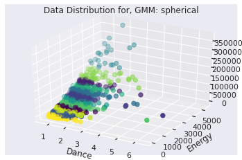
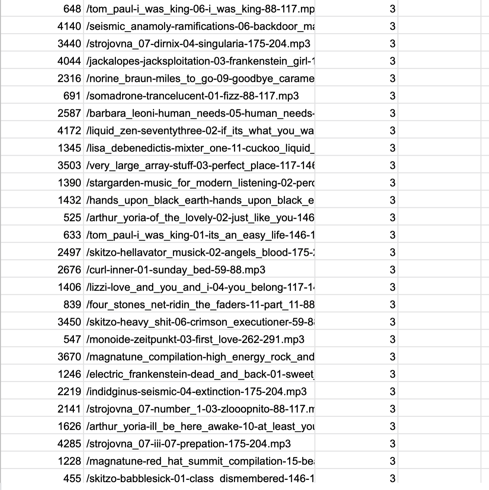
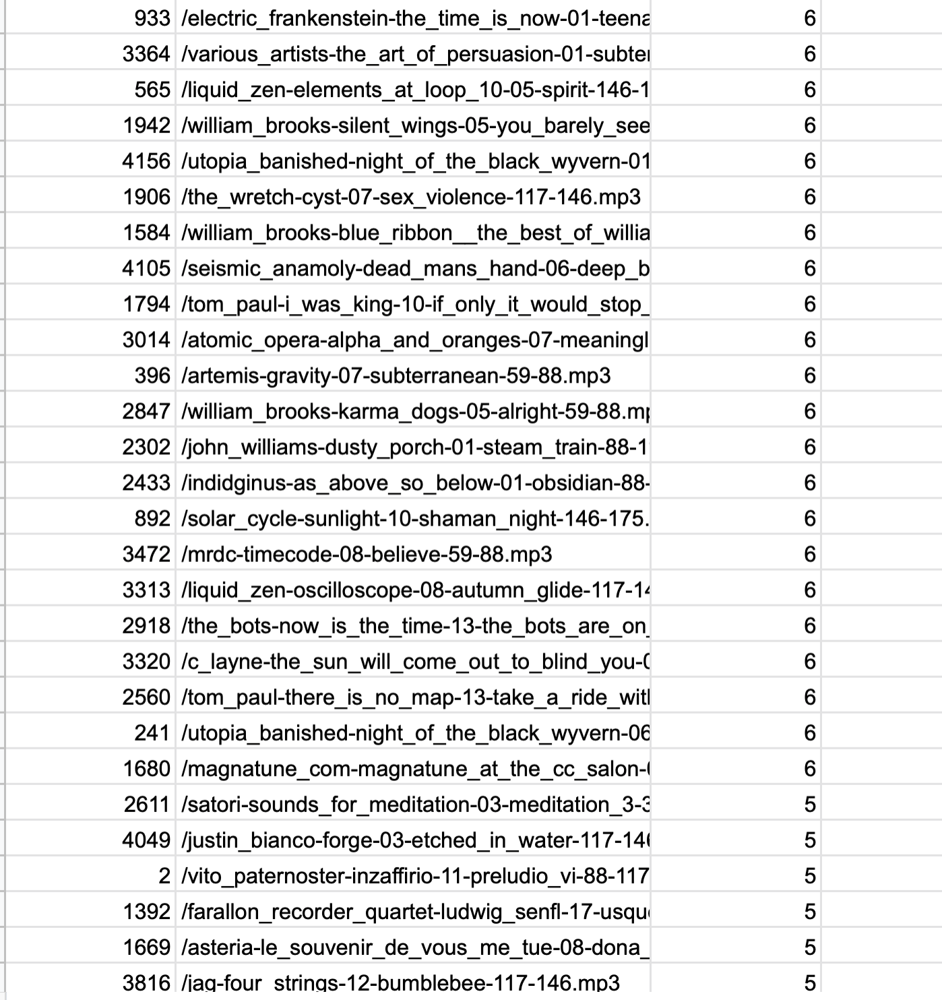

## The Problem

Given a data set of  1,500 + songs how can Ianalyze the audio content of these songs to make recommendations for new songs from a second data base of 1,500+ songs. It was also not allowed to use any metadata (song name etc.) to sort or identify songs. With this large of a data base a secondary challenge was developing an analysis method that would keep the run time to a minimum. This was, as professor Visell intended, a very vague problem description where many different approaches and solutions where possible. 

## The Solution

By examining features such as beat, energy and loudness using the Essentia library I used a Gaussian Mixture Model (GMM) to group the first data base of songs into ten categories or "playlists" as I liked to think of them. Based on the parameters of these initial categories I was able to place the second grouping of songs 
into one of these ten groupings based on their audio characteristics. For example if you had a collection of country music, classical music and rap on your spotify this model would make recommendations of new songs for each genre.

## About Gaussian Mixture Models 

Gaussian Mixtures are ideal for this problem since they allow for unsupervised learning which is necessity given that we don't know what is considered a correct classification. Since GMM is a probabilistic model, it assumes that all data points are generated from a mixture of a finite number of Gaussian distributions that can be clumped into a defined number of groups. More specifically, GMM works by creating ellipsoid functions around groupings of data and determining the likely hood that a point is contained in one data grouping over the other.


## Let's Get To Coding 
- First, we load the songs from our data base.
- Second songs are appended to a massive matrix using the Pandas library.
- Then the four features that we have chosen from the Essentia library are extracted.
- Finally, the features extracted from multiple points within each song are appended to the row corresponding to each song and loaded into a csv file.
- Using the csv file to save features after they where calculated was instrumental in saving time. 

```{r, eval = FALSE}
base_path = '/content/drive/Shared drives/ECE160-Visell-2020/Media Files/similarity_dataFolder'
#'/content/drive/My Drive/ECE160/Project3/music_sub'
 #You'll need to change this path to reflect where the data is in your Drive
rhythm_extractor = es.RhythmExtractor2013(method="multifeature")
fs = 44100
file_names = glob.glob(os.path.join(base_path, '*mp3'))
a = []
song_list = []
feature_size = 0
num_songs = 0
length = len(base_path)

for song in file_names:
  num_songs +=1
  song_name = song[length:]
  song_list.append(song_name)
  audioSig = es.MonoLoader(filename=song,sampleRate=fs)()
  
  #danceability: range from 0 to 3 for most danceable
  dance= es.Danceability()
  r,s = dance(audioSig)
  a = np.append (a, r)
  #print("Dance: ",r)

  #energy: computes the energy of an array
  energy= es.Energy()
  a = np.append (a, energy(audioSig))
  #print("Energy estimate:", energy(audioSig))

  #loudness: computes loudness as the energy of the signal raised to the power of 0.67
  loud= es.Loudness()
  a = np.append (a, loud(audioSig))
  #print("Loudness estimate:", loud(audioSig))

  # centroid
  cent= es.Centroid()
  a = np.append (a, cent(audioSig))
  #print("Centroid estimate:", cent(audioSig))

  if (num_songs == 1):
      feature_size = len(a) 

  
a = a.reshape(num_songs,feature_size)

pd.DataFrame(song_list).to_csv("/content/drive/My Drive/ECE160/song_name.csv")
pd.DataFrame(a).to_csv("/content/drive/My Drive/ECE160/f300.csv")


```

## Building the Data Set and Reading CSV files 
  - Here we organize the data from our CSV file and randomize it into test and training sets. 
  - Keep in mind these are not the typical test and training sets since we won't be able to measure the accuracy or our model, at least not quantitatively. The two sets are more to simulate the real world applications of this program.
  - Note for our train and test split we do a 50:50 split. Typically the split is 70:30 however, I didn't want to exclude genres by overly reducing the size of the training data. Even when data is randomized, in my experience, things still tend to get "clumped" in certain areas. 
  
```{r, eval = FALSE}
  
    def Build_Data_Set():
    song_names = pd.read_csv("/content/drive/My Drive/ECE160/song_name.csv")
    song_names.columns = ["ID","song"]
    song_names=song_names.drop(columns=['ID'])
  
    data_df = pd.read_csv("/content/drive/My Drive/ECE160/f2,500.csv")
    data_df.columns = ['ID','dance','energy','loud','cent.']
    data_df.insert(5, 'song_names', song_names)
    data_df = data_df.reindex(np.random.permutation(data_df.index))
  
    data_df = data_df.drop(columns=['ID'])
    return data_df
    
  
```
  
## Plotting the perliminary Data 

  - Here we initially plot a 2D graph in order to get a sense of how the data is distributed. 
-   I also created a smaller data set to test the model on before applying the full data set.

```{r, eval = FALSE}

### _________________HEY ____________________________________

### USE 150 for 300 sub set

### use 1250 for full set 
##___________________________________________________________

data = Build_Data_Set()
index = 1250


X_train = data[:index ]
X_test = data[index:]

song_arr_test = X_test.loc[:,'song_names']
song_arr_train= X_train.loc[:,'song_names']

print (song_arr_train)
print (song_arr_test)
plt.figure(figsize=(7,7))
plt.scatter(data["dance"],data["loud"])
plt.xlabel('Dance')
plt.ylabel('Loud')
plt.title('Data Distribution')
plt.show()

```

## Testing and Training using Sklearn

Gaussian Mixture Types [(sklearn)](https://scikit-learn.org/stable/modules/generated/sklearn.mixture.GaussianMixture.html)

-   Full: each component has its own general covariance matrix

-   Tied: all components share the same general covariance matrix
-   Diag: each component has its own diagonal covariance matrix
-   Spherical: each component has its own single variance

12 categories or clusters where chosen based on existing documentation [(Berenzweig et al. 2004.)](https://www.ee.columbia.edu/~dpwe/pubs/BerenLEW04-museval.pdf)


```{r, eval = FALSE}
X_train = X_train.drop(columns=['song_names'])
X_test = X_test.drop(columns=['song_names'])

from sklearn.mixture import GaussianMixture
gmm = GaussianMixture(n_components=12, covariance_type='full', random_state=0).fit(X_train)
gmmt = GaussianMixture(n_components=12, covariance_type='tied', random_state=0).fit(X_train)
gmmd = GaussianMixture(n_components=12, covariance_type='diag', random_state=0).fit(X_train)
gmms = GaussianMixture(n_components=12, covariance_type='spherical', random_state=0).fit(X_train)
probs_train = gmm.predict_proba(X_train)
test  = gmm.predict(X_test)
probs_test = gmm.predict_proba(X_test)
print("probs_train",probs_train[:20].round(3))
#print("probs_test", probs_test[:20].round(3))
```


## Plotting GMM Clusters for Test Data

The plots bellow display the data points or songs that are color coded based on the cluster they where assigned by the model. This allows us to visualize the effect of different modifications to the GMM. Ultimately, I chose to use "full" setting for our actual song recommendations. 

```{r, eval = FALSE}
fig = plt.figure()
ax = plt.axes(projection='3d')
plt.gca()
labels = gmm.fit(X_test).predict(X_test)
ax.scatter(X_test['dance'], X_test['loud'],X_test['energy'], c=labels, s=40, cmap='viridis', zorder=2)
plt.xlabel('Dance')
plt.ylabel('Energy')
plt.title('Data Distribution for, GMM: full')

fig = plt.figure()
ax = plt.axes(projection='3d')
plt.gca()
labels = gmmt.fit(X_test).predict(X_test)
ax.scatter(X_test['dance'], X_test['loud'],X_test['energy'], c=labels, s=40, cmap='viridis', zorder=2)
plt.xlabel('Dance')
plt.ylabel('Energy')
plt.title('Data Distribution for, GMM: tied')

fig = plt.figure()
ax = plt.axes(projection='3d')
plt.gca()
labels = gmmd.fit(X_test).predict(X_test)
ax.scatter(X_test['dance'], X_test['loud'],X_test['energy'], c=labels, s=40, cmap='viridis', zorder=2)
plt.xlabel('Dance')
plt.ylabel('Energy')
plt.title('Data Distribution for, GMM: diag')

fig = plt.figure()
ax = plt.axes(projection='3d')
plt.gca()
labels = gmms.fit(X_test).predict(X_test)
ax.scatter(X_test['dance'], X_test['loud'],X_test['energy'], c=labels, s=40, cmap='viridis', zorder=2)
plt.xlabel('Dance')
plt.ylabel('Energy')
plt.title('Data Distribution for, GMM: spherical')
```





## Appending the song recomendations to a csv file 


```{r, eval = FALSE}
lables_clusters = gmm.predict(X_train)
cluster_matrix = pd.DataFrame(lables_clusters) 
song_train = pd.DataFrame(song_arr_train)
song_train.insert(1, 'clusters', lables_clusters)
song_train = song_train.sort_values(by=['clusters'],ascending=False)
print('Training Data')
print (song_train)
song_train.to_csv("/content/drive/My Drive/ECE160/song_train.csv")


lables = gmm.predict(X_test)
matrix = pd.DataFrame(lables) 
song_test = pd.DataFrame(song_arr_test)
song_test.insert(1, 'clusters', lables)
song_test = song_test.sort_values(by=['clusters'],ascending=False)
print('Testing Data')
print (song_test)
song_test.to_csv("/content/drive/My Drive/ECE160/song_test.csv")

```

*Click the images to enlarge them*

{width=500px}

{width=500px}

{width=500px}

## Citations 

Berenzweig, A. (2004). A Large-Scale Evaluation of Acoustic and Subjective Music- Similarity Measures. Retrieved from https://www.ee.columbia.edu/~dpwe/pubs/BerenLEW04-museval.pdf
