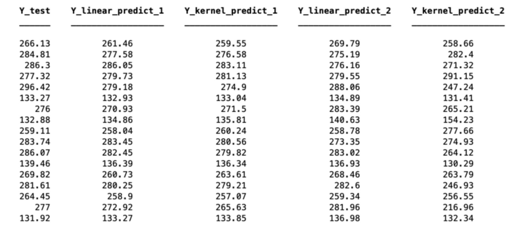

The projects shown below are summaries of projects I have completed for my classes and for fun. Further details can be found about each project by clicking on the heading.

## [Predicting Race Times ](https://github.com/andreaanez/164-ucsb-track-ml)

  In this project my partner [Lu Han](https://www.linkedin.com/in/lu-alice-han-495920160/) and I analyzed histoical data from members of the UCSB track team and used it along with other attributes to predict future race times for the 800 and 1600 meter events. 
  Using a Cubic Polynomial Kernel and Afine Linear Regression we reached a MSE of 18 and 11 respectively when comparing actual and predicted race times. Due to over fitting with the Cubic Polynomial Kernel method we selected Linear Regression for our final results. A benefit of the Linear Regression model is that it alowed us to identify the most influential attributes in predicting an athletes time. The results from one randomization of the test and training data for the women's team is shown below. 

   

